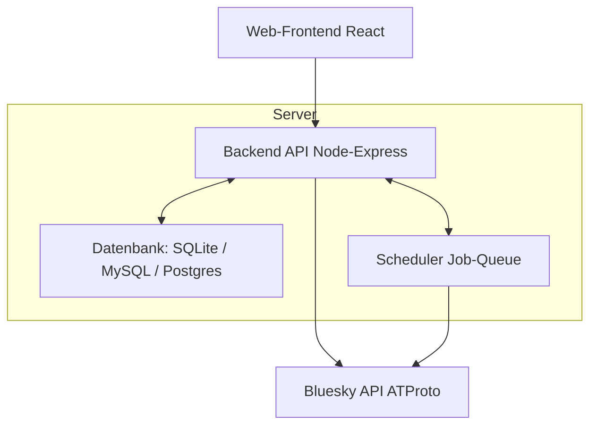
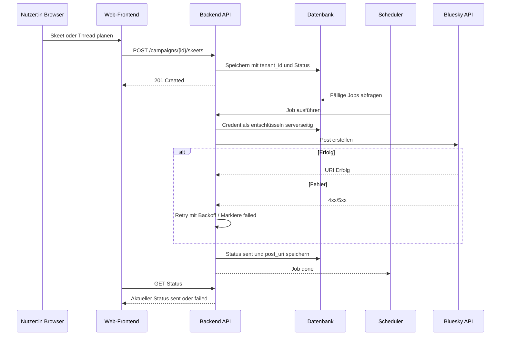
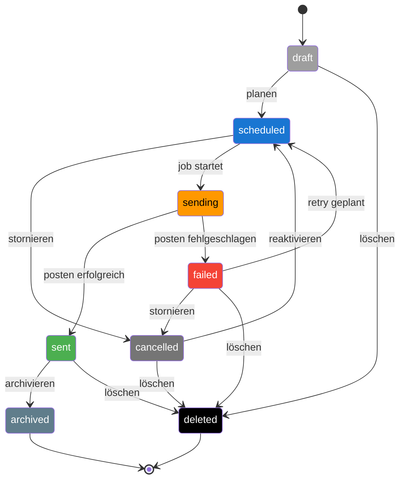

# Systemarchitektur – BSky-Kampagnen-Bot

Dieses Dokument beschreibt den technischen Aufbau des Projekts auf hoher Ebene.  
Es dient als Orientierung für Entwickler:innen und Mitwirkende.

---

## Komponentenübersicht

**1. Web-Frontend**

- Implementiert in **React** (Vite-Build)
- UI für:
  - Kampagnenverwaltung
  - Skeet-/Thread-Planung
  - Medien-Uploads mit Alt-Texten
  - Nutzer- und Rollenverwaltung
- Kommuniziert ausschließlich über die REST-API des Backends

**2. Backend/API**

- Implementiert in **Node.js** (Express)
- Hauptaufgaben:
  - REST-API für Frontend und externe Integrationen
  - Authentifizierung & Autorisierung (Multi-Tenant-fähig)
  - Scheduler-Logik für geplante Posts
  - Verwaltung von Kampagnen, Skeets, Threads, Medien
- Sicherheit:
  - Passwort-Hashing mit Argon2id
  - Verschlüsselung sensibler Tokens (z. B. Bluesky-App-Passwörter)

**3. Datenbank**

- ORM: Sequelize
- Standard: SQLite (Zero-Config)
- Optional: MySQL/PostgreSQL (per `.env`)
- Enthält:
  - Multi-Tenant-Struktur (`tenant_id` in allen relevanten Tabellen)
  - Kampagnen- und Posting-Daten
  - Medien-Metadaten
  - Job-Queue für Scheduler
  - Audit-Logs

**4. Scheduler**

- Hintergrundprozess innerhalb des Backends
- Überwacht die Job-Queue (`Jobs`-Tabelle)
- Führt geplante Veröffentlichungen pünktlich aus
- Unterstützt:
  - Retries mit Backoff
  - Concurrency-Limits pro Tenant
  - Abbruch und Neuplanung

**5. Bluesky-Integration**

- ATProto-Client für:
  - Authentifizierung via App-Passwort oder Session-Token
  - Posten von Skeets/Threads mit Medien
  - Abrufen von Metriken (Likes, Reposts, Replies)
- Erweiterbar zu einem vollständigen Bluesky-Client (Phase 3 der Roadmap)

---

## Architekturdiagramm



---

## Datenfluss



---

## State-Machines

### Skeet



---

### Thread Status


```mermaid

```

> **Hinweis:**  
> Die in den Diagrammen verwendeten Statusfarben entsprechen exakt den definierten UI-Badges  
> aus der [Statusfarben-Tabelle](#statusfarben-ui-empfehlung).  
> Dadurch entsteht eine 1:1-Wiedererkennung zwischen Dokumentation, State-Diagrammen und der Benutzeroberfläche.

---

## Legende & Notizen

### Statusbedeutungen

- **draft**: Entwurf – noch nicht zur Ausführung geplant.
- **scheduled**: Geplant – Ausführungstermin steht fest (UTC).
- **sending**: Wird gerade gepostet (Job läuft).
- **sent**: Erfolgreich veröffentlicht; `post_uri` gespeichert.
- **failed**: Veröffentlichen fehlgeschlagen (Fehler in `last_error`, `attempts++`).
- **cancelled**: Manuell gestoppt; wird nicht automatisch ausgeführt.
- **archived**: Erfolgreich abgeschlossen und logisch archiviert.
- **deleted**: Hart gelöscht (Daten entfernt, nicht wiederherstellbar).

### Typische Aktionen → Übergänge

- **Planen**: `draft → scheduled`
- **Stornieren**: `scheduled → cancelled`
- **Starten (Job)**: `scheduled → sending`
- **Erfolg buchen**: `sending → sent`
- **Fehler buchen**: `sending → failed`
- **Retry ansetzen**: `failed → scheduled`
- **Reaktivieren**: `cancelled → scheduled`
- **Archivieren**: `sent → archived`
- **Löschen**: `draft|failed|cancelled|sent → deleted`

### Regeln & Verhalten

- **Idempotenz**: Jeder Post‑Job prüft vor dem Senden, ob bereits eine `post_uri` existiert.
- **Retries**: Exponentielles Backoff bis `MAX_ATTEMPTS`; danach verbleibt `failed`.
- **Zeit & TZ**: Alle Zeiten in **UTC** speichern; Kampagnen‑TZ nur für UI/Planung.
- **Mandantentrennung**: Jeder Vorgang ist `tenant_id`‑gebunden; Cross‑Tenant‑Referenzen sind unzulässig.
- **Soft vs. Hard Delete**: `archived` = Aufbewahrung mit Lesezugriff; `deleted` = physische Entfernung.
- **Kaskaden**: Beim Löschen von Threads werden zugehörige Thread‑Skeets per `ON DELETE CASCADE` entfernt (Skeets selbst nur, wenn explizit gewünscht).

### Fehlerfälle (Kurzüberblick)

- **API‑Fehler 4xx/5xx**: `sending → failed` mit `last_error`; Scheduler setzt Retry.
- **Rate‑Limit**: Als Fehler behandeln, Backoff erhöhen.
- **Timeout**: Vor Retry wird geprüft, ob die Veröffentlichung trotz Timeout erfolgreich war (Dedupe über `post_uri`/Request‑ID).

## Statusfarben (UI-Empfehlung)

| Status    | Farbe (Hex) | Bedeutung im UI                                        |
| --------- | ----------- | ------------------------------------------------------ |
| draft     | `#9e9e9e`   | Grau – Entwurf, noch nicht geplant                     |
| scheduled | `#1976d2`   | Blau – Geplant, wartet auf Ausführung                  |
| sending   | `#ff9800`   | Orange – Wird gerade gesendet                          |
| sent      | `#4caf50`   | Grün – Erfolgreich veröffentlicht                      |
| failed    | `#f44336`   | Rot – Veröffentlichung fehlgeschlagen                  |
| cancelled | `#757575`   | Dunkelgrau – Manuell gestoppt                          |
| archived  | `#607d8b`   | Blau-Grau – Erfolgreich abgeschlossen & archiviert     |
| deleted   | `#000000`   | Schwarz – Endgültig gelöscht (nicht wiederherstellbar) |

**Hinweise:**

- Farben bewusst kontrastreich gewählt (AA-Kontrast für Barrierefreiheit).
- Für helle/dunkle Themes ggf. leichte Anpassungen.
- Einheitliche Farbzuordnung auch in Diagrammen verwenden (State-Machine, Listen, Detailansicht).
- Im Frontend Status-Badge mit beschreibendem Text + Farbe darstellen, nicht nur Farbe (für Screenreader).
