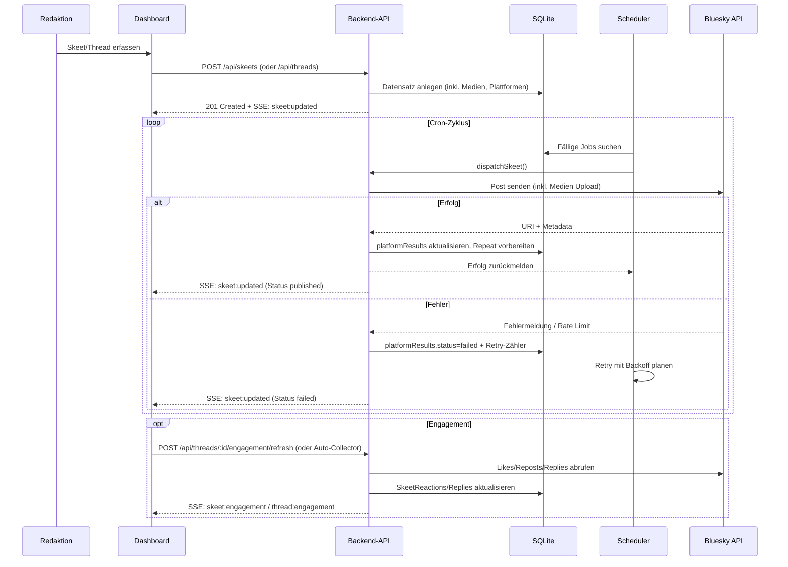

# Datenfluss – Post erstellen

Das folgende Sequence-Diagramm beschreibt den regulären Ablauf vom Planen eines Skeets bis zur Veröffentlichung über den Scheduler. Fehler- und Retry-Pfade sind eingezeichnet, um das Verhalten bei API-Problemen zu verdeutlichen.

