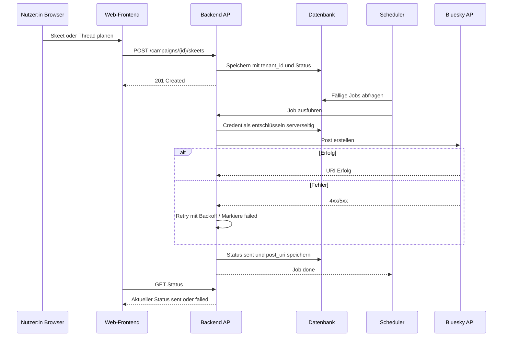

---

### `docs/diagramme/datenfluss.md`
```markdown
# Datenfluss – Post erstellen

Vereinfachtes Sequence‑Diagramm für das Planen und Veröffentlichen eines Posts (Skeet oder Thread).
```


```mermaid
sequenceDiagram
  participant U as Nutzer:in Browser
  participant FE as Web-Frontend
  participant BE as Backend API
  participant DB as Datenbank
  participant SCH as Scheduler
  participant BSKY as Bluesky API

  U->>FE: Skeet oder Thread planen
  FE->>BE: POST /campaigns/{id}/skeets
  BE->>DB: Speichern mit tenant_id und Status
  BE-->>FE: 201 Created

  SCH->>DB: Fällige Jobs abfragen
  SCH->>BE: Job ausführen
  BE->>DB: Credentials entschlüsseln serverseitig
  BE->>BSKY: Post erstellen
  alt Erfolg
    BSKY-->>BE: URI Erfolg
  else Fehler
    BSKY-->>BE: 4xx/5xx
    BE->>BE: Retry mit Backoff / Markiere failed
  end
  BE->>DB: Status sent und post_uri speichern
  BE-->>SCH: Job done
  FE->>BE: GET Status
  BE-->>FE: Aktueller Status sent oder failed
```