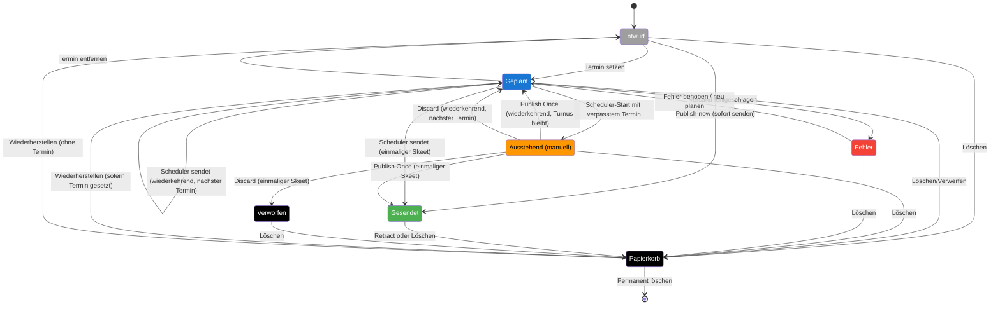

# Lebenszyklus – Skeet

Das Zustandsdiagramm zeigt die Status eines einzelnen Skeets und die wichtigsten Übergänge. Die Farben orientieren sich an der [Statusfarben-Legende](./statusfarben.md).

> Wiederkehrende Skeets (`repeat != 'none'`) verbleiben nach einem regulären Versand im Status *Geplant* (*scheduled*); der Scheduler berechnet beim Versand automatisch den nächsten Termin. Verpasste Wiederholungen landen beim Scheduler-Start in *pending_manual* (*Ausstehend (manuell)*) und können von dort aus einmalig gesendet oder verworfen werden.
