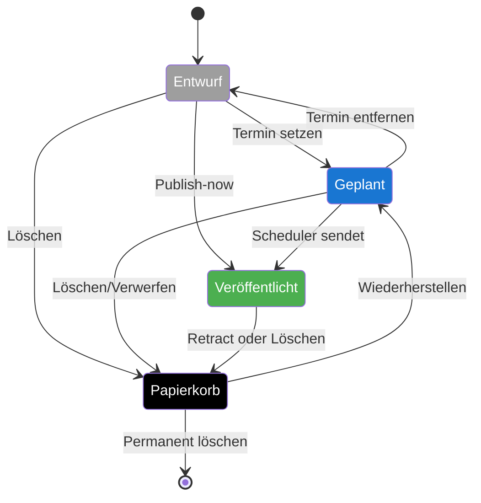

# Lebenszyklus – Skeet

Das Zustandsdiagramm zeigt alle möglichen Status eines einzelnen Skeets und die wichtigsten Übergänge. Die Farben orientieren sich an der [Statusfarben-Legende](./statusfarben.md).

> Wiederkehrende Skeets (`repeat != 'none'`) bleiben nach erfolgreicher Ausführung im Status *Geplant* – der Scheduler berechnet beim Versand automatisch den nächsten Termin.
