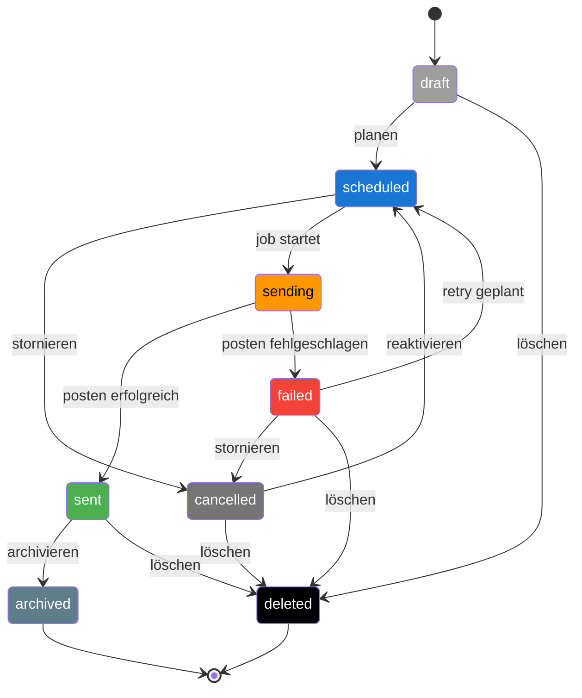

---

### `docs/diagramme/lebenszyklus_skeet.md`
```markdown
# Lebenszyklus – Skeet

Zustände und Übergänge eines Skeets im Kampagnen‑Bot.  
Die Farben entsprechen der [Statusfarben‑Legende](./statusfarben.md).
```

