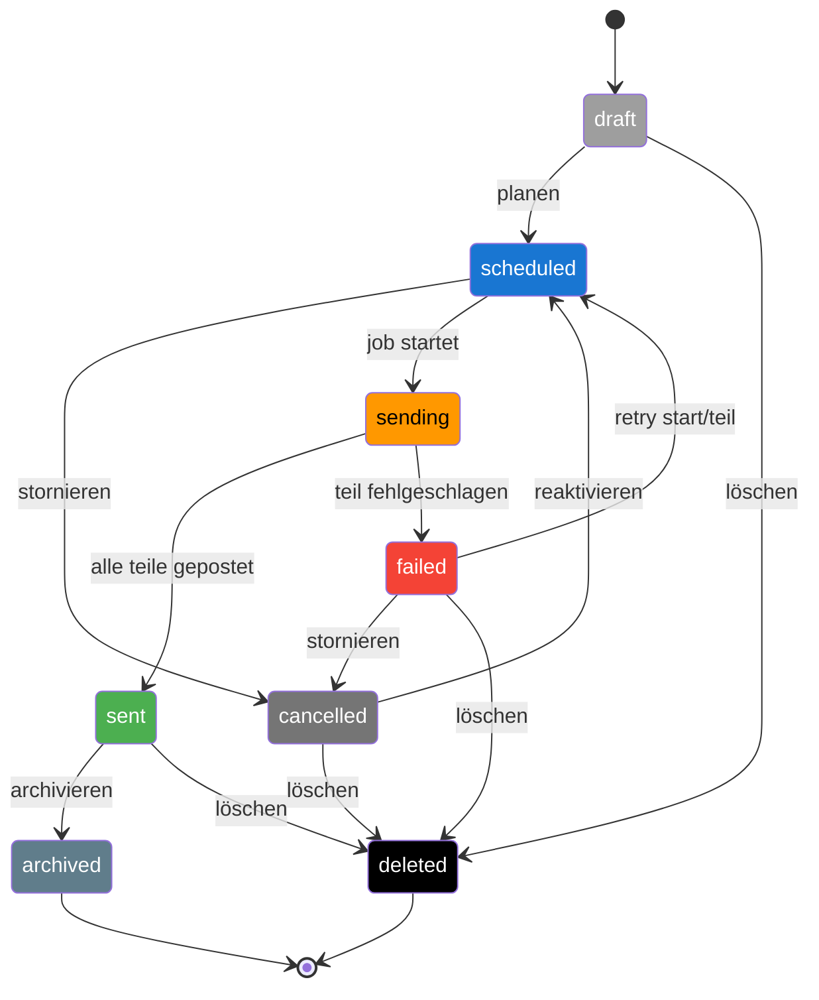

---

### `docs/diagramme/lebenszyklus_thread.md`
```markdown
# Lebenszyklus – Thread

Zustände und Übergänge eines Threads.  
Die Farben entsprechen der [Statusfarben‑Legende](./statusfarben.md).
```

