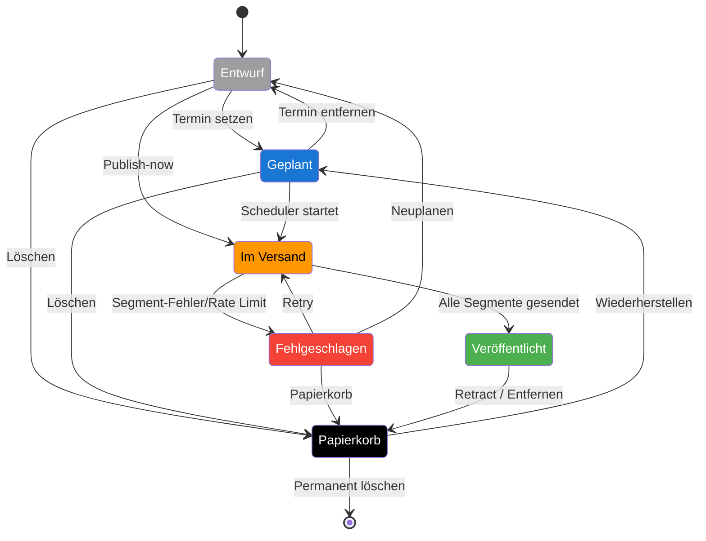

# Lebenszyklus – Thread

Das Diagramm zeigt, wie sich der Status eines mehrteiligen Threads verändert. Übergänge berücksichtigen sowohl erfolgreiche Komplettveröffentlichungen als auch Fehler bei einzelnen Posts.

> *Teilweise gesendet*: Wenn nur einzelne Plattformen/Segmente fehlschlagen, bleibt der Thread in `publishing` bis der Scheduler alle Segmente verarbeitet hat. Betroffene Plattformen werden in `platformResults` mit Status `partial` markiert.
