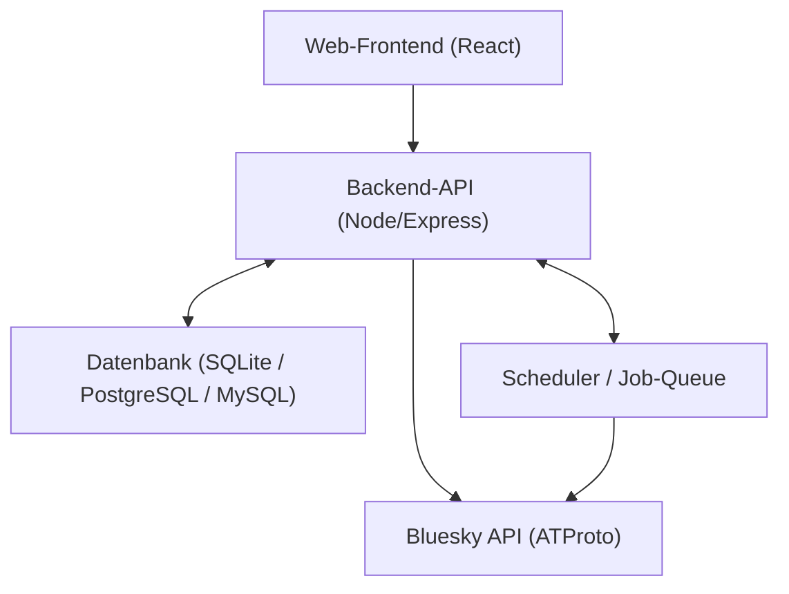

# Systemarchitektur

Das Diagramm vermittelt einen schnellen Überblick über die Kernkomponenten des Systems und deren Interaktionen.

> Für produktive Setups empfiehlt sich zusätzlich ein Reverse Proxy (z. B. Traefik oder Nginx) vor Backend und Frontend.
