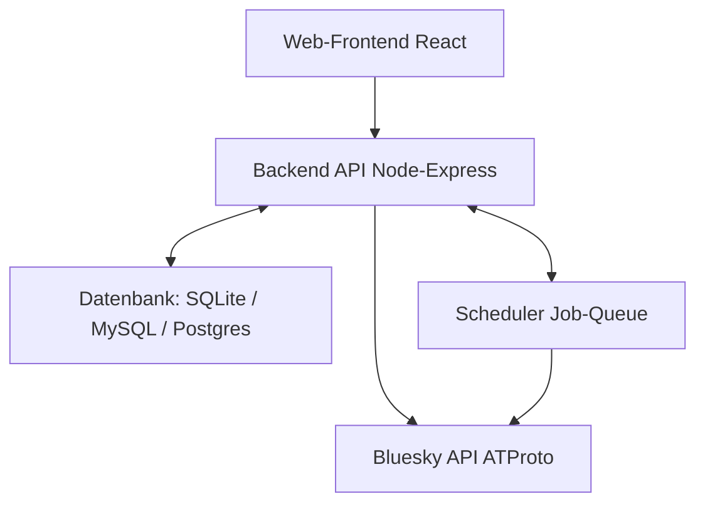

# Systemarchitektur

Kurzer Überblick über die Hauptkomponenten und ihre Beziehungen.  
Details zur Gesamtarchitektur findest du auch in der Projektdoku.

```mermaid
flowchart TD
  FE["Web-Frontend React"]
  BE["Backend API Node-Express"]
  DB["Datenbank: SQLite / MySQL / Postgres"]
  SCH["Scheduler Job-Queue"]
  BSKY["Bluesky API ATProto"]

  FE --> BE
  BE <--> DB
  BE <--> SCH
  BE --> BSKY
  SCH --> BSKY
```